# ATL 1

# BookNow

BookNow ist eine selbst entwickelte Full-Stack Buchungsplattform, die es Firmen ermöglicht, Dienstleistungen zu verwalten und Terminbuchungen zu organisieren. Privatkunden können sich ganz einfach registrieren und bei der gewünschten Firma eine Dienstleistung buchen. Das Projekt entstand im Rahmen eines Studienmoduls, wurde jedoch eigenständig konzipiert und umgesetzt. Ziel war es, eine vollständige Webanwendung zu entwickeln und moderne Entwicklungspraktiken praktisch anzuwenden.

## 🚀 Ziel des Projekts

Das Hauptziel war der Aufbau einer funktionsfähigen Plattform, mit der Firmen eigene Dienstleistungen erstellen, verwalten und die Privatkunden Termine buchen können. Dabei sollten Backend, Datenbank, Frontend und Authentifizierung zu einer lauffähigen Lösung integriert werden.

## 🧰 Tech Stack

- **Backend:** Java, Spring Boot  
- **Frontend:** React  
- **Datenbank (Development):** PostgreSQL
- **Datenbank (Cloud Deployment):** SQLite  
- **API:** REST  
- **Authentifizierung:** JWT (JSON Web Token)  
- **Build & Dependency:** Maven  
- **Versionierung:** Git, GitHub

## Hauptfunktionen

- Registrierung und Login für Firmenkunden und Privatkunden
- Anlegen und Verwalten von Dienstleistungen  
- Terminbuchung für Kundinnen und Kunden  
- Authentifizierung mit JWT  
- Datenhaltung in PostgreSQL  
- Client-Server-Kommunikation über REST API

## Architekturüberblick

Das Backend basiert auf einer klassischen Schichtenarchitektur:
- **Controller Layer**: REST-Endpunkte  
- **Service Layer**: Business-Logik  
- **Repository Layer**: Datenbankzugriff via JPA/Hibernate

Das Frontend wurde mit React aufgebaut und kommuniziert über HTTP mit dem Backend. Die Datenbank wird lokal oder in der Cloud betrieben.

## Lern- und Entwicklungsfokus

- Praktische Anwendung von Java Spring Boot und React in einem Full-Stack Kontext  
- Aufbau einer REST API und Integration ins Frontend  
- JWT-basiertes Authentifizierungssystem  
- Umgang mit relationalen Datenbanken  
- Strukturierte Codeorganisation und Versionierung

## Lizenz / Hinweis

Dieses Projekt ist ein Lern- und Showcase-Projekt, das im Rahmen des Studiums entstanden ist und kontinuierlich weiterentwickelt wird. Es dient als praktischer Nachweis meiner Erfahrung in Full-Stack-Entwicklung.

---------------------------------------------------------------------------------------------------

# ATL 2
Hinweis: Es wurde ein Redirect erstellt, von der, von Cloud Run erstellten URL, auf die URL https://booknow-98891799677.europe-west6.run.app/swagger-ui/index.html,
weil die von Cloud Run erstellte URL nicht direkt auf das Swagger-UI verweist. 
 
Falls der Redirect nicht funktioniert bitte die URL /swagger-ui/index.html an die Cloud Run URL anhängen.

## Inhaltsverzeichnis
## Inhaltsverzeichnis
1. **[Einleitung](#1-einleitung)**
2. **[Cloud Build](#2-cloud-build)**
    - [2.1 Trigger Erstellen](#21-trigger-erstellen)
    - [2.2 Test Erfolgreich](#22-test-erfolgreich)
    - [2.3 Test Fehlgeschlagen](#23-test-fehlgeschlagen)
3. **[Artifact Registry](#3-artifact-registry)**
4. **[Cloud Run](#4-cloud-run)**
5. **[Herausforderungen](#5-herausforderungen)**
6. **[Reflexion](#6-reflexion)**

## 1. Einleitung
In diesem Dokument wurde die Umsetzung des ATL 2 beschrieben. Dabei wurden die einzelnen Schritte erläutert, die für die Realisierung erforderlich waren.  
Zusätzlich wurden die Herausforderungen dargestellt, die während der Umsetzung aufgetreten sind.
  
Im Rahmen des Projekts wurde entschieden, SQLite anstelle von PostgreSQL zu verwenden.  
Diese Wahl wurde getroffen, um den Betrieb in Cloud Run ohne die Notwendigkeit einer kostenpflichtigen Cloud SQL-Instanz zu ermöglichen.  
SQLite bietet den Vorteil, serverlos und leichtgewichtig zu sein, was die Komplexität bei der Konfiguration reduziert und die Anwendung portabler macht.

## 2. Cloud Build
Dieser Abschnitt beschreibt die Implementierung des Cloud Build-Prozesses. Es wird beschrieben wie ein Trigger erstellt, die Tests durchgeführt und wie die Tests in Cloud Build integriert wurden.
Zu vermerken ist, dass ich mein Dockerfile schon in ATL 1 erstellt habe und es deshalb nicht nochmals erstellen musste.

Bevor ein Trigger erstellt wurde, musste das cloudbuild.yaml erstellt werden. Das cloudbuild.yaml enthält die Schritte, die Cloud Build durchführt, wenn ein Trigger ausgelöst wird: 

- id: "Run Tests"  
  name: maven:3.9.4-eclipse-temurin-20  
  entrypoint: mvn  
  args: ["clean", "test"]

Da in ATL 2 Tests im Fokus stehen, habe ich den Schritt „Run Tests“ integriert. In diesem Schritt werden die Tests durchgeführt. 
Der Name des Schritts ist "Run Tests", der Name des Images ist "maven:3.9.4-eclipse-temurin-20" und die Argumente sind "clean" und "test".

### 2.1 Trigger Erstellen
#### 2.1.1. Zuerst habe ich in Cloud Build, dass ich über die Google Cloud Console erreichte, ein neues Projekt erstellt.
   Die einzelnen Schritte sind auf den folgenden Bildern ersichtlich:
  
Hier wurde durch klicken auf "Neues Projekt" ein neues Projekt erstellt.
 
   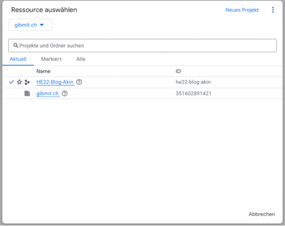
  
Als nächstes musste der Projektname eingeben und schlussendlich das Projekt erstellt werden.
 
   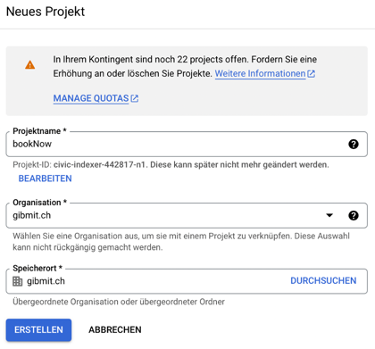
  
Nachdem das Projekt erstellt wurde, musste ich das Projekt auswählen, damit ich mich im korrekten Projekt befinden konnte.
 
   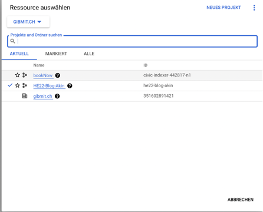
  
Als ich mich im korrekten Projekt befand, erschien das Fenster, um den Cloud Build API zu aktivieren.
 
   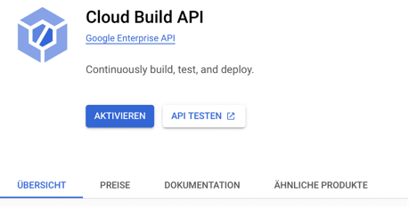
  
#### 2.1.2. Sobald die Cloud Build-API aktiviert wurde, erschien die Maske zur Trigger-Erstellung. Wichtig bei der Erstellung des Triggers war, dass man das entsprechende Repository verbindet:
   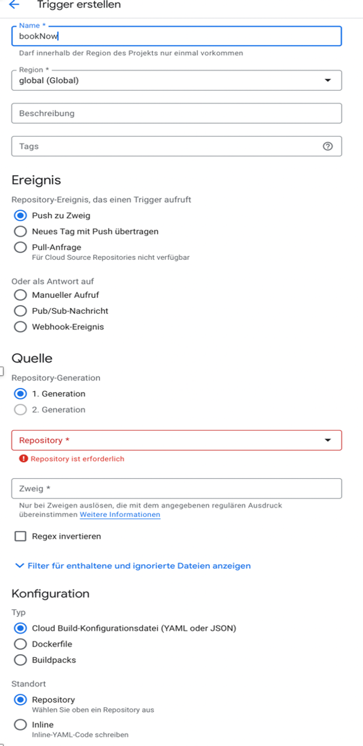
  
Über ‚Neues Repository verbinden‘ lässt sich das gewünschte Repository auswählen und verbinden
 
   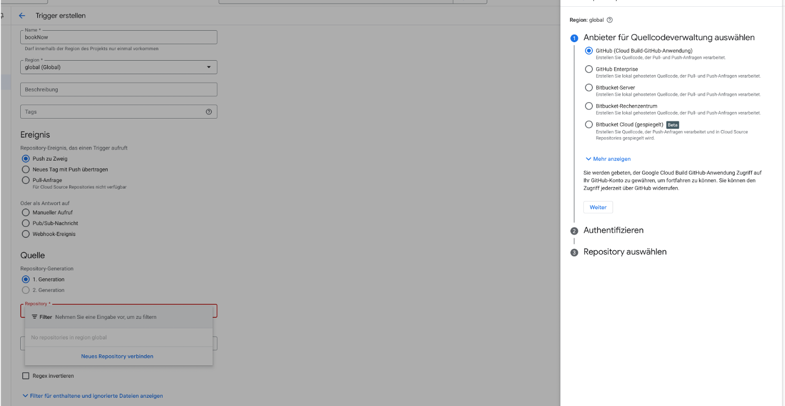
  

*Hinweis: Wenn die entsprechende Repository nicht aufgelistet wird, muss man auf "Repositories auf GitHub bearbeiten" klicken, um die Berechtigungen zu erteilen.*

   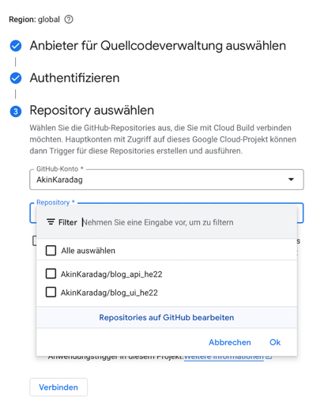
  

*Auf Github wird man direkt auf die korrekte Seite weitergeleitet, um die Berechtigungen zu erteilen. Hier kann man das entsprechende Repository auswählen und die Berechtigungen erteilen.*

   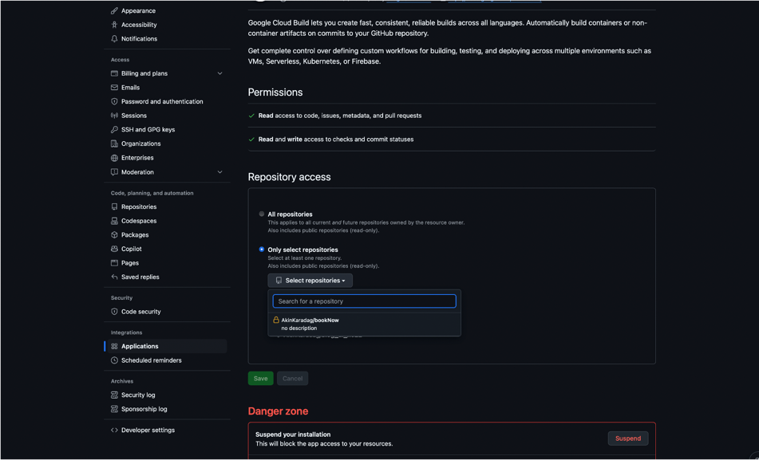
   

#### 2.1.3. Nachdem das Repository verbunden wurde, konnte ich in der Liste das entsprechende Repository auswählen und auf "Ok" klicken.
 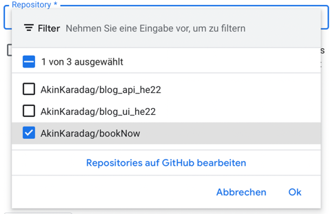
  
Mit der aktivierten Checkbox musste ich auf "Verbinden" klicken, um das Repository zu verbinden.
 
   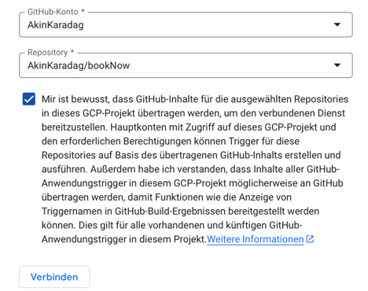
  

#### 2.1.4. Erst wenn das Repository verbunden war, konnte ich den Trigger erstellen (Probleme die aufgetreten sind, werden in den nächsten Zeilen erläutert). Bei Dienstkonto musste das entsprechende Konto gewählt werden, jedoch hatte ich hier das Problem, dass mir das entsprechende Dienstkonto nicht angezeigt wurde.
 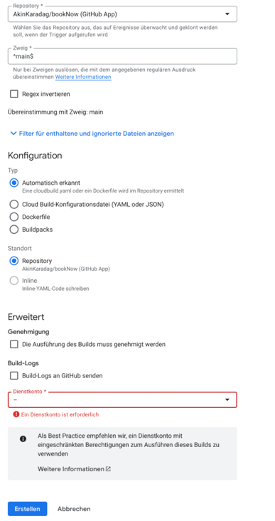

#### 2.1.5. Ich habe verschiedene wege versucht, um das Dienstkonto zu finden. Denn manuell konnte ich es auch nicht angeben.

***2.1.5.1. Ich habe versucht, in den Einstellungen das Dienstkonto, dass mir angezeigt wurde als "bevorzugtes Dienstkonto" festzulegen, was jedoch auch nicht funktionierte.***
 
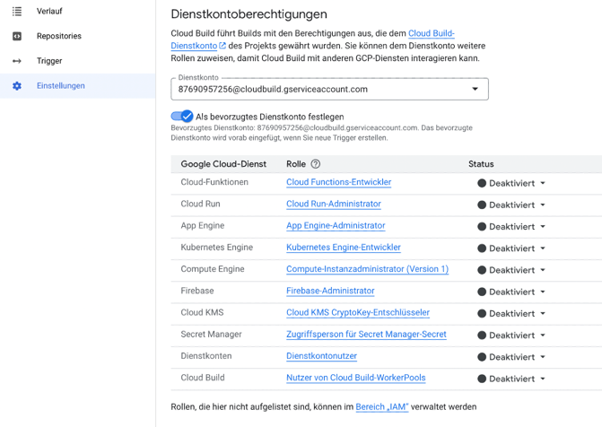
 

***2.1.5.2. Als auch das Projekt löschen und neu erstellen nichts gebracht hatte, habe ich mir das ganze etwas näher angeschaut. Mithilfe des Internets, fand ich den Fehler - mein cloudbild.yaml war im falschen Verzeichnis, d.h. nicht im root.***
 
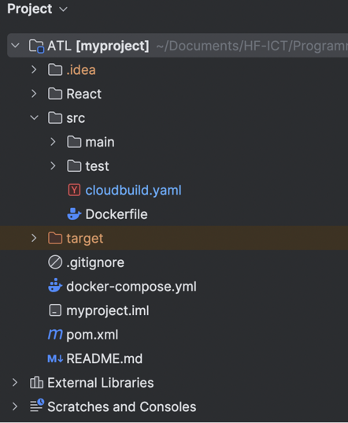
  

#### 2.1.6. Nachdem ich das cloudbuild.yaml im root Verzeichnis hatte, konnte ich das Dienstkonto auswählen und den Trigger erstellen.
#### 2.1.7. Nun hatte ich jedoch das Problem, dass die Builds immer fehlschlugen, d.h. die Tests schlugen fehl. Nach einem längeren Debug Prozess, fand ich heraus, dass mein SecurityConfigTest das Build störte. Ich habe für die ATL diesen Test in pom.xml ausgeschlossen:
   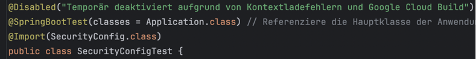
   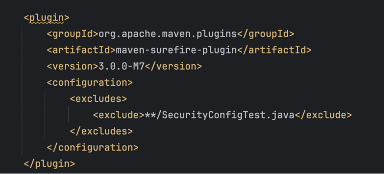
  

### 2.2 Test Erfolgreich
Nachdem ich den SecurityConfigTest ausgeschlossen hatte, konnte ich den Trigger erstellen und die restlichen Tests wurden erfolgreich durchgeführt.
 
   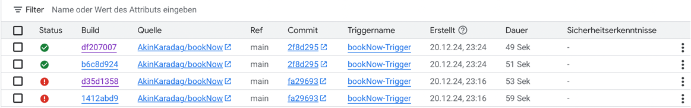
 
   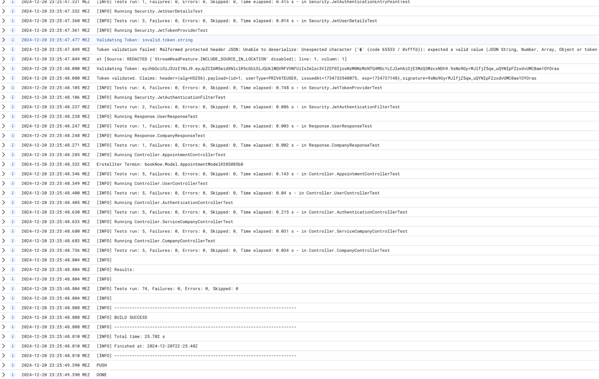

### 2.3 Test Fehlgeschlagen
#### 2.3.1. Um das Verhalten von Cloud Build zu testen, bei einem fehlgeschlagenen Test, habe ich die Test-Klasse "UserResponseTest" so manipuliert, dass die erwartete E-Mail-Adresse nicht mit der tatsächlichen E-Mail-Adresse übereinstimmt.
#### d.h. ich habe die erwartete korrekte E-Mail-Adresse "testuser@example.com" mit "wrongtestuser@example.com" ersetzt.
 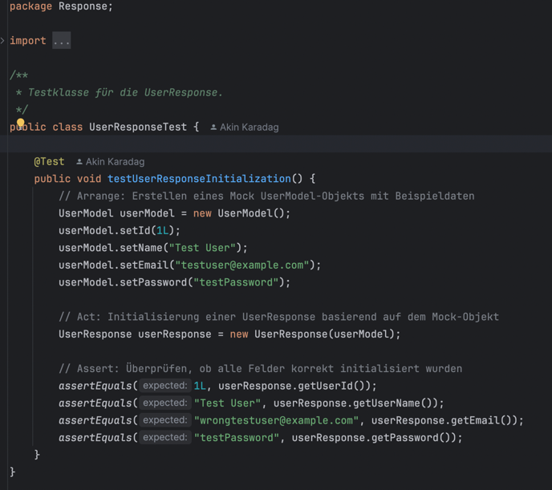
  

#### 2.3.2. Wie erwartet schlug der Test fehl und das Build gab div. Errors zurück.
 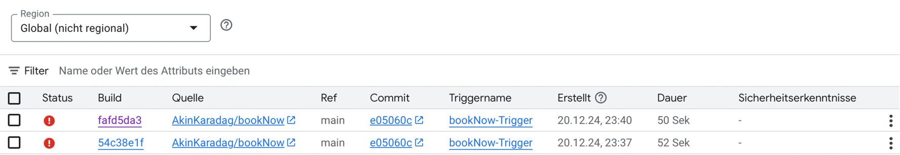
 
   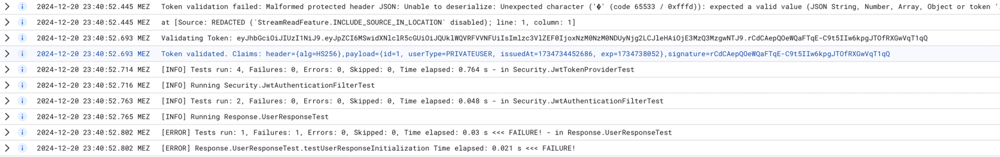
 
   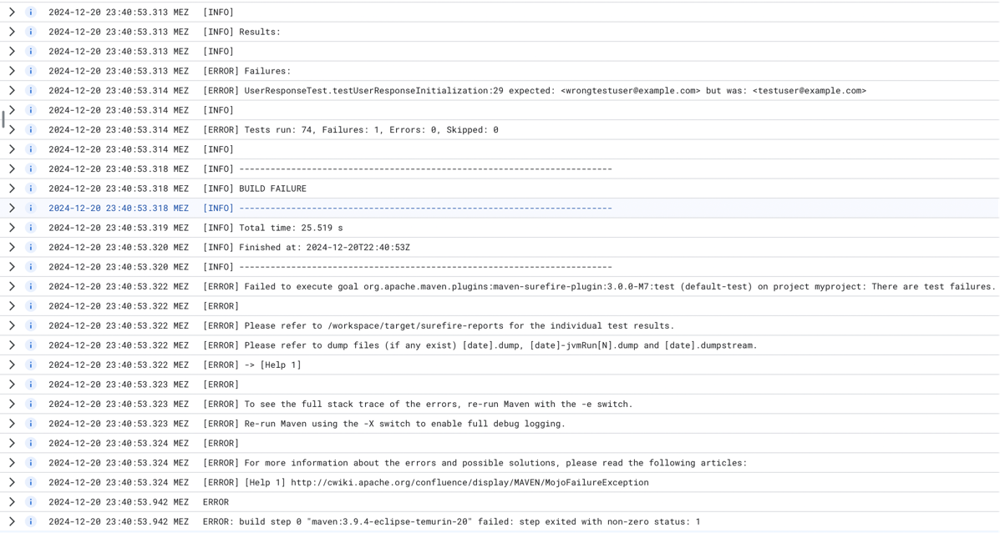
  

## 3. Artifact Registry
Der nächste Schritt war die Erstellung des Artifact Registry. Hier wird beschrieben, wie das Artifact Registry erstellt und wie das Docker-Image in das Artifact Registry hochgeladen wurde.
#### 3.1. Als Erstes habe ich mein cloudbuild.yaml angepasst, damit das Docker-Image in das Artifact Registry hochgeladen wird. Die entsprechenden Zeilen sind wie folgt:

- id: "Build Docker Image"  
  name: gcr.io/cloud-builders/docker  
  args: [  
  "build",  
  "-t", "europe-west6-docker.pkg.dev/booknow-akin/docker-repo-booknow/booknow-docker-img:$COMMIT_SHA",  
  "." ]
  
- id: "Push Docker Image"  
  name: gcr.io/cloud-builders/docker  
  args: [ "push", "europe-west6-docker.pkg.dev/booknow-akin/docker-repo-booknow/booknow-docker-img:$COMMIT_SHA" ]

Zunächst wird das Docker-Image erstellt und anschliessend ins Artifact Registry hochgeladen. Die Region europe-west6-docker sind Servergruppen, in diesem Fall in Zürich.
booknow-akin ist der Container-Name, docker-repo-booknow ist der Repository-Name in Artifact Registry und booknow-docker-img ist der Image-Name.
$COMMIT_SHA ist eine Umgebungsvariable, die den Commit SHA des Commits enthält, der das Build ausgelöst hat.
 
#### 3.2. Danach habe ich in Artifact Registry ein Repository erstellt. Die Konfiguration ist wie folgt:
 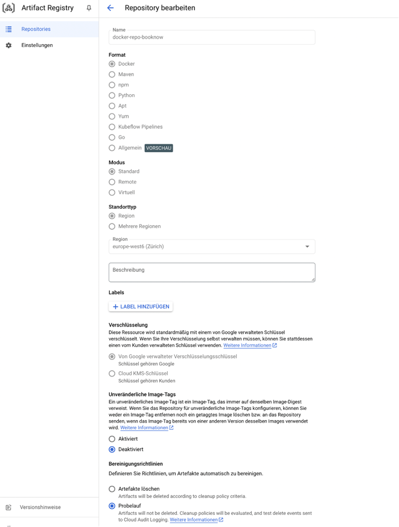
  

#### 3.3. Es wurde nach einem Build kein Docker-Image erstellt, deshalb habe ich mal all die Berechtigungen aktiviert, die auch für das Cloud Run nötig waren. Automatisch wurde auch Cloud Run Admin API aktiviert. Zusätzlich habe ich in IAM dem Dienstkonto die Rolle "Cloud Functions-Admin" gegeben.
   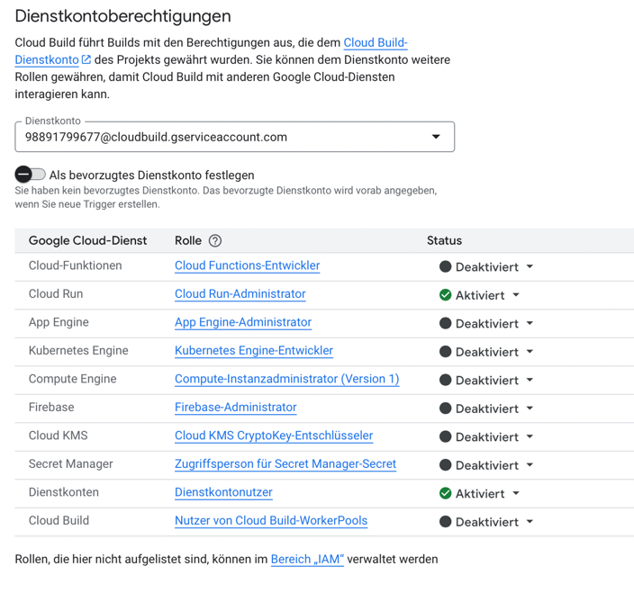
 
   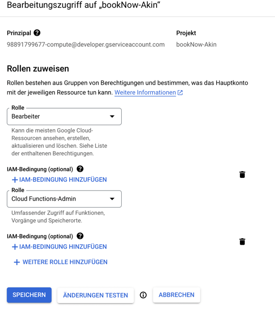
  

#### 3.4. Danach hatte ich eine weitere Fehlermeldung, dass im Build-Log ersichtlich war. Die Fehlermeldung war wie folgt: «no permission to read /dev/mem/». Diesen Fehler habe ich versucht mit der Rolle "artifactregistry.writer" zu lösen, was jedoch nicht funktionierte. Die Rolle "artifactregistry.admin" habe ich auch vergeben.
Die Rolle habe ich mit folgendem Command im Google CLI vergeben: 
   gcloud projects add-iam-policy-binding [PROJECT_ID] \  
   --member="serviceAccount:[SERVICE_ACCOUNT_EMAIL]" \  
   --role="roles/artifactregistry.writer"
  
#### 3.5. Als das nicht funktionierte wurde mir klar, dass mein Dockerfile am falschen Ort war und ich ein Refactoring machen musste. Ich habe das Dockerfile in das root Verzeichnis verschoben und die entsprechenden Pfade angepasst.
#### 3.6. Nachdem ich das Dockerfile im root Verzeichnis hatte, konnte ich das Docker-Image erstellen und in das Artifact Registry hochladen.
 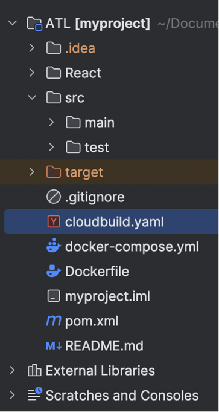
 
   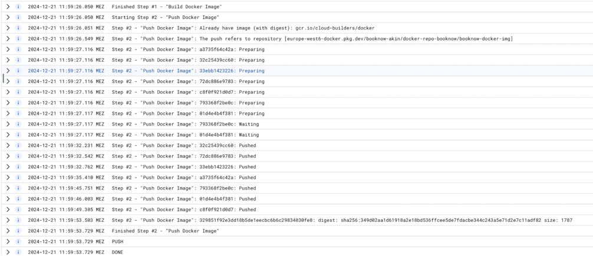
 
   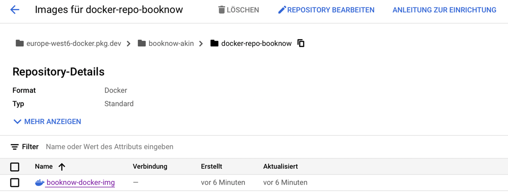

   
## 4. Cloud Run
Um den Cloud Run zu erstellen, habe ich zuerst mein cloudbuild.yaml angepasst, damit das Docker-Image in Cloud Run Deployed wird. Die entsprechenden Zeilen sind wie folgt:
- id: "Deploy to Cloud Run"  
  name: gcr.io/cloud-builders/gcloud  
  args: [  
  "run",  
  "deploy",  
  "booknow",  
  "--min-instances",  
  "0",  
  "--max-instances",  
  "1",  
  "--image",  
  "europe-west6-docker.pkg.dev/booknow-akin/docker-repo-booknow/booknow-docker-img:$COMMIT_SHA",  
  "--region",  
  "europe-west6",  
  "--timeout",  
  "300s",  
  "--allow-unauthenticated",  
  "--port",  
  "8080"  
  ]

Run Deployed das Docker-Image in Cloud Run. Der Name des Services ist "booknow", die Mindestanzahl von Instanzen ist 0 und die maximale Anzahl von Instanzen ist 1. Das Docker-Image wird aus dem Artifact Registry geladen. 
Die Region ist europe-west6, der Timeout beträgt 300 Sekunden, der Service ist nicht authentifiziert und der Port ist 8080.

Aufgrund einiger Probleme, die in den nächsten Zeilen erläutert werden, habe ich den Timeout auf 300 Sekunden gesetzt.

#### 4.1. Nachdem ich das cloudbuild.yaml angepasst hatte, konnte ich das Docker-Image nicht in Cloud Run Deployen. Ich erhielt immer die Fehlermeldung, dass die Datenbank nicht erreichbar war, weil [CLOUD SQL INSTANCE] fehlte, was ich nicht hatte.
#### Nach einiger Recherche fand ich heraus, dass mit PostgreSQL eine Cloud SQL-Instanz erstellt werden muss, das kostenpflichtig ist. In meiner Applikation hatte ich PostgreSQL verwendet.
 

#### 4.2. Ich entschied mich, auf SQLite umzusteigen, weil somit keine Cloud SQL-Instanz erstellt werden muss. SQLite ist eine Datenbank, die in einer Datei gespeichert wird und keine Server-Instanz benötigt.
#### Ich habe alle relevanten Dateien angepasst, um SQLite zu verwenden. Die entsprechenden Files sind wie folgt:
- application.properties
- pom.xml
- Dockerfile
- Neues File erstellt bookNowDB.sqlite
  
#### 4.3. Leider hatte ich immer noch Probleme, weil beim Deployen immer noch versucht wurde auf postgresql zuzugreifen.
 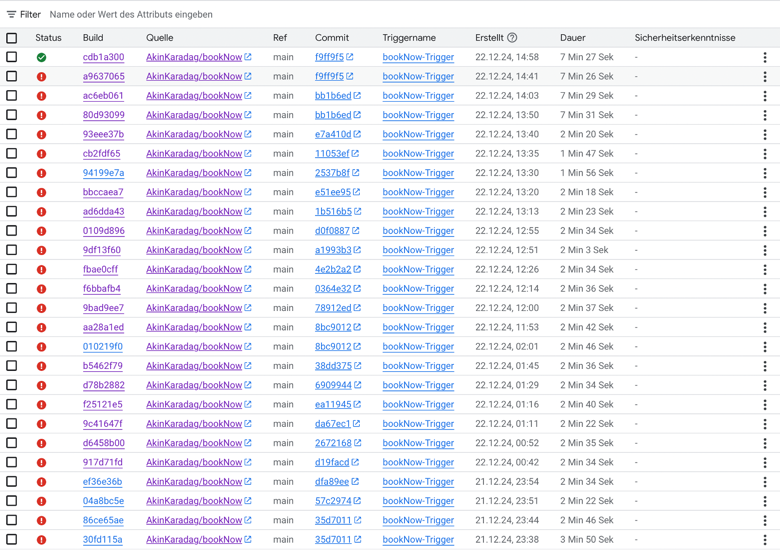
 
   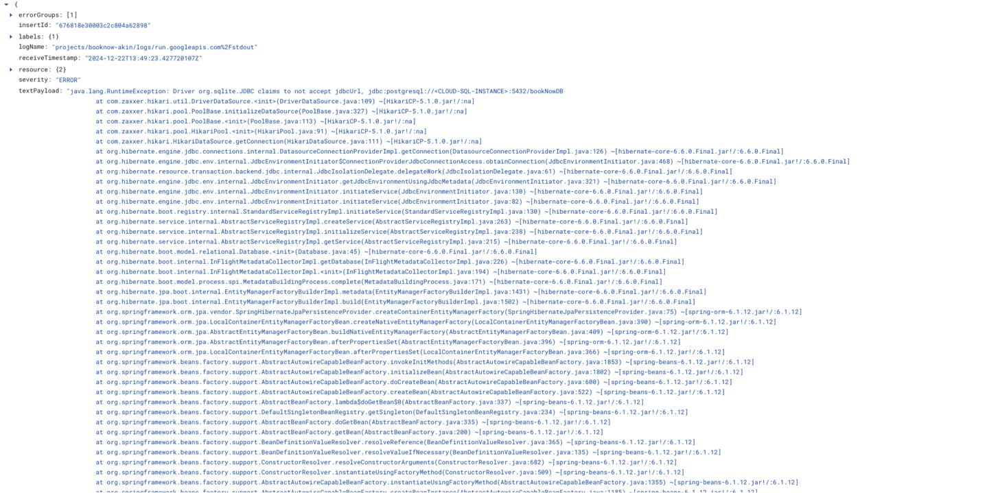
  

#### 4.4. Als ich feststellte, dass sich nichts ändert, egal was ich mache, wurde mir klar, dass die alten Images noch vorhanden sind und die alte Konfiguration liefen. Deshalb habe ich alle Images gelöscht und ein neues Image sowie Container erstellt.
#### Weil ich auch lokal nicht auf das Image in Docker gekommen bin (lokale tests), habe ich auch die lokalen Images und Container gelöscht und einen neuen Container mit Image erstellt.
 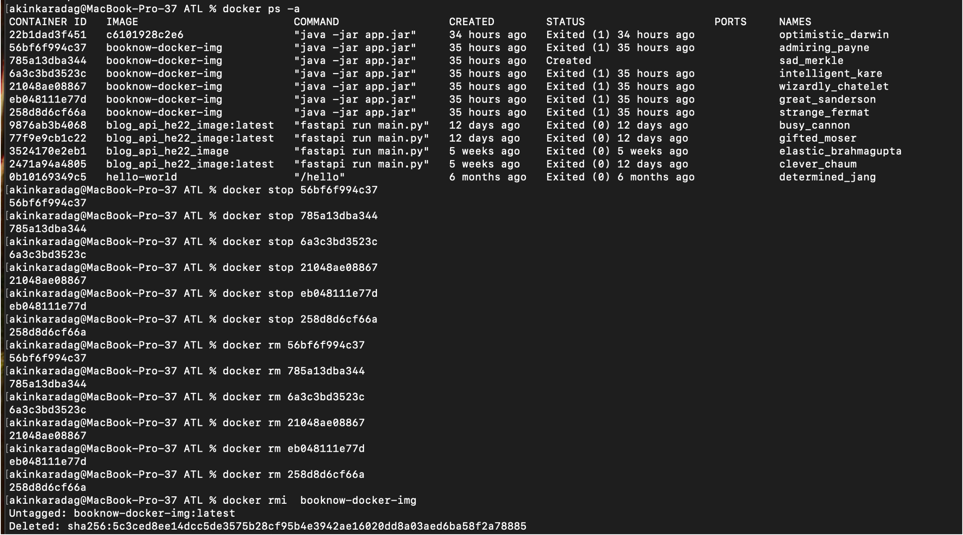
 
    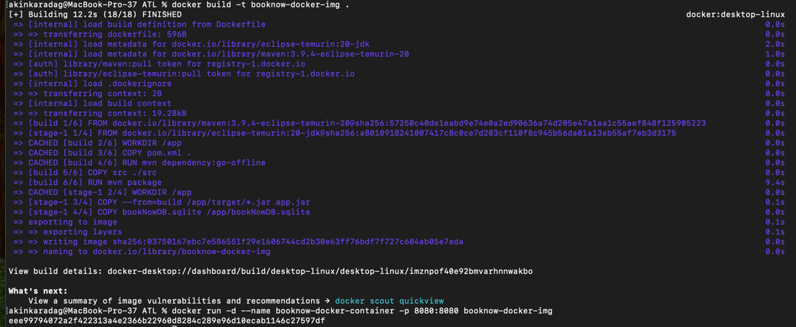
  

#### 4.5. Mit dem neuen Image konnte ich das Docker-Image in Cloud Run Deployen und erfolgreich auf mein Backend zugreifen:
 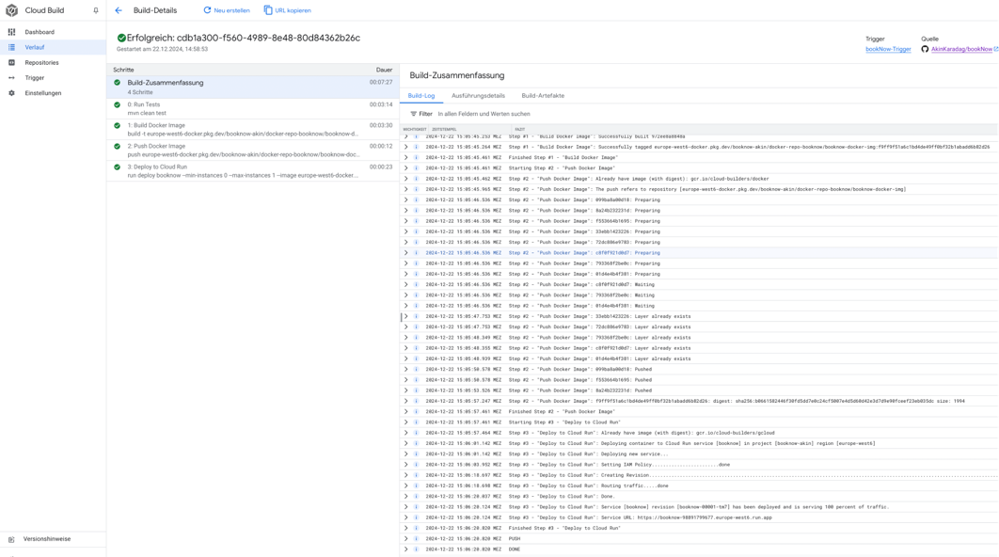
 
    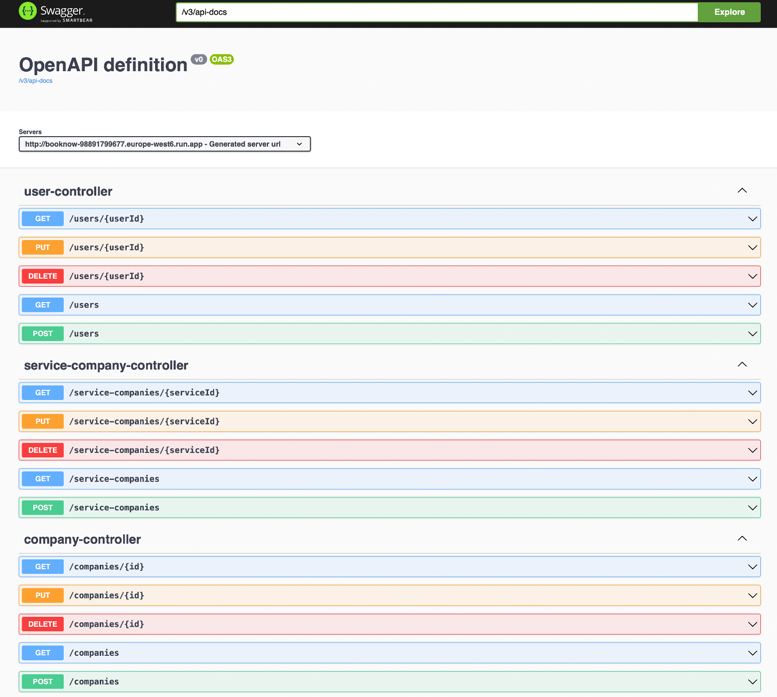
  

## 5. Herausforderungen
Hier werden die oben genannten Herausforderungen nochmals zusammengefasst:
#### 5.1. Trigger Erstellen
- Das cloudbuild.yaml war im falschen Verzeichnis, d.h. nicht im root.
- Der SecurityConfigTest hat das Build gestört, deshalb habe ich ihn ausgeschlossen.
- Das Dienstkonto wurde nicht angezeigt, weil das cloudbuild.yaml im falschen Verzeichnis war.

#### 5.2. Artifact Registry
- Der Fehler "no permission to read /dev/mem/" wurde durch die Rolle "artifactregistry.writer" und "artifactregistry.admin" nicht gelöst.
- Das Docker-Image wurde nicht erstellt, weil das Dockerfile im falschen Verzeichnis war.

#### 5.3. Cloud Run
- Die Datenbank war nicht erreichbar, weil [CLOUD SQL INSTANCE] fehlte.
- Beim Deployen wurde immer noch versucht auf postgresql zuzugreifen, obwohl ich auf SQLite umgestiegen bin.
- Die alten Images und Container waren noch vorhanden, deshalb habe ich sie gelöscht und neue erstellt.

## 6. Reflexion
Die Arbeit an ATL 2 war wirklich eine spannende und lehrreiche Erfahrung. Ich bin ziemlich stolz darauf, wie viel ich während des Projekts gelernt habe.  
Besonders interessant fand ich die Arbeit mit Google Cloud und all den Tools wie Docker, SQLite und Cloud Run.  
Es war cool zu sehen, wie das Zusammenspiel der Technologien funktioniert und wie ich sie in meinem Projekt nutzen konnte.  
 
Natürlich gab es einige Herausforderungen, aber gerade die haben mich am meisten weitergebracht.  
Ob es nun darum ging, die richtige Konfiguration für Cloud Build zu finden, von PostgreSQL auf SQLite umzusteigen oder die alten Docker-Images zu löschen – jede Hürde hat mir geholfen, tiefer in die Themen einzutauchen.  
Besonders wichtig war dabei, die Logs genau zu analysieren und gezielt nach Lösungen zu suchen. Das war definitiv eine der grössten Lektionen, die ich mitgenommen habe. 
 
Was mir besonders gefallen hat, war die Möglichkeit, das Gelernte direkt anzuwenden. Es ist einfach motivierend, wenn man am Ende sieht, wie alles zusammenkommt und funktioniert.  
Ich habe auch gelernt, geduldig zu bleiben und Schritt für Schritt vorzugehen, gerade wenn die Dinge nicht sofort klappen. 
 
Für zukünftige Projekte nehme ich mir vor, noch mehr auf Details zu achten, vor allem bei Logs und Fehlermeldungen.  
Aber vor allem möchte ich mir die Freude am Lernen und Ausprobieren bewahren, die mich bei diesem Projekt getragen hat. 
 
Alles in allem war ATL 2 eine richtig gute Erfahrung. Ich habe nicht nur viel gelernt, sondern auch gemerkt, wie ich mit solchen Herausforderungen wachsen kann.  
Ich freue mich schon darauf, dieses Wissen in den nächsten Projekten einzusetzen. 

